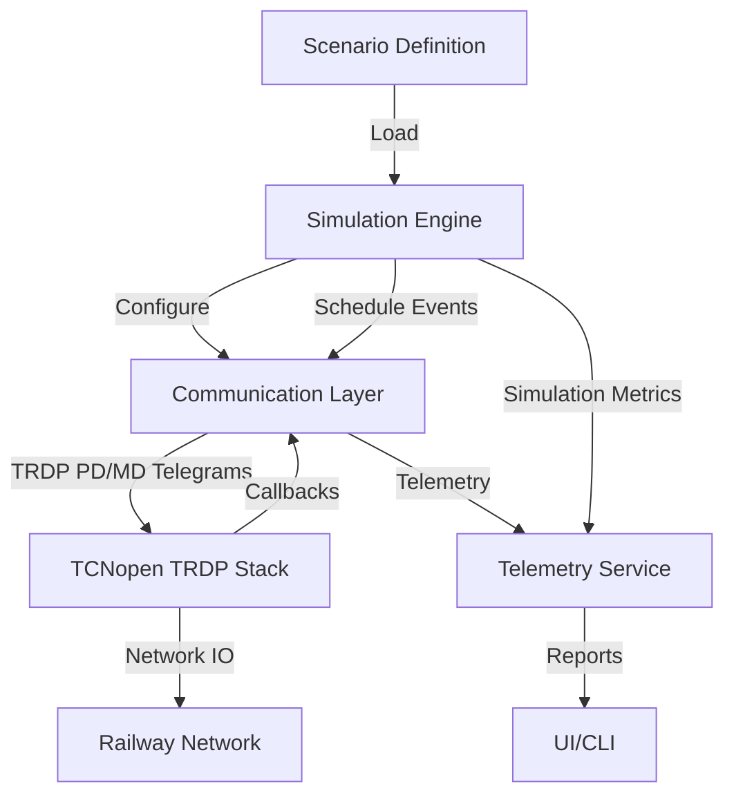
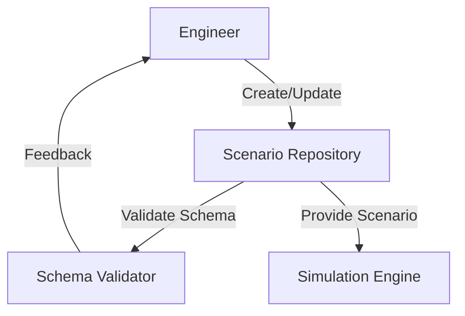
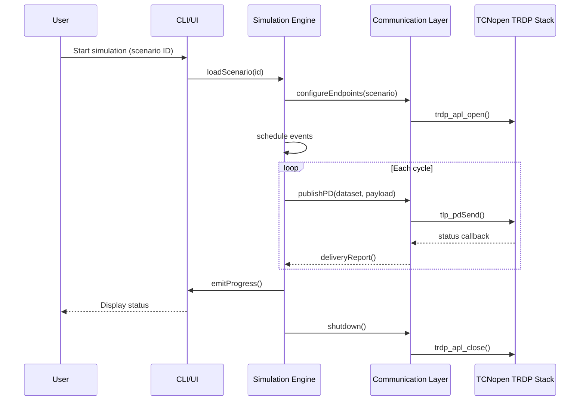
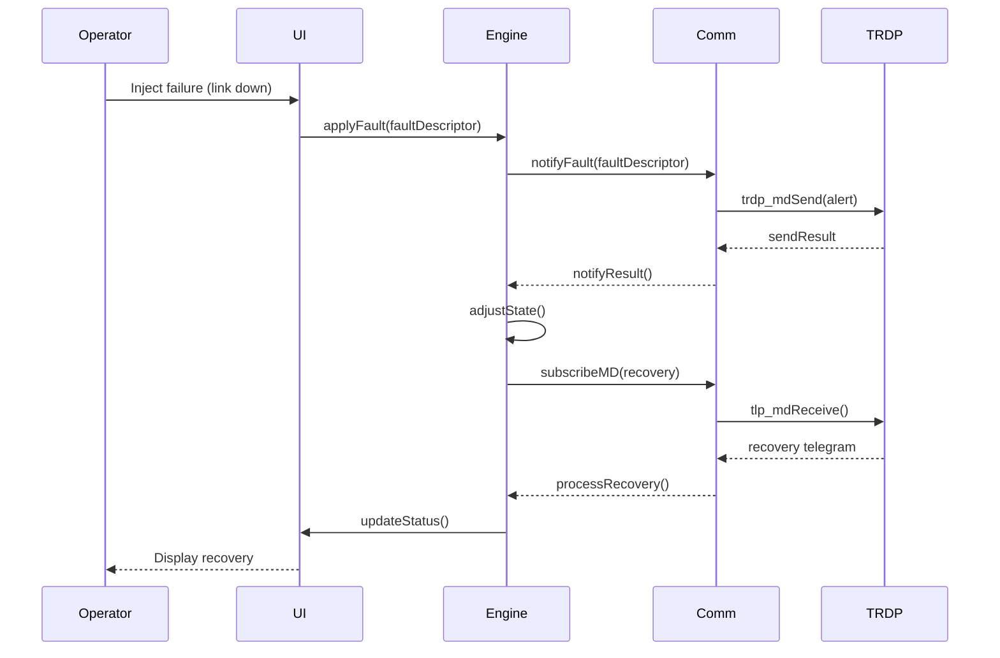

# TRDP Simulator Architecture and Design

## 1. Architecture Overview
The TRDP Simulator is structured as a modular system that separates transport-level communication from simulation logic and user interaction. The following core modules form the baseline architecture:

### 1.1 Communication Layer
- **Purpose:** Provide a thin, testable wrapper around the TCNopen TRDP stack for both Process Data (PD) and Message Data (MD) services.
- **Responsibilities:**
  - Manage TRDP application, session, and dataset lifecycles (initialization, configuration, shutdown).
  - Publish and subscribe to PD telegrams with configurable repetition, redundancy, and integrity checks.
  - Send, receive, and acknowledge MD telegrams including segmentation support.
  - Expose diagnostic and monitoring hooks (e.g., link status, error events, statistics) for the simulation engine and UI.

### 1.2 Simulation Engine
- **Purpose:** Orchestrate simulation scenarios and enforce deterministic execution.
- **Responsibilities:**
  - Load scenario definitions (topology, timetable, telegram templates, triggers) from configuration files or APIs.
  - Coordinate simulation steps, scheduling telegram transmissions, stimulus events, and failure injections.
  - Maintain simulation state (virtual train consist, network environment, TRDP endpoint status).
  - Record timelines, events, and metrics for reporting and post-analysis.

### 1.3 Scenario Repository & Configuration
- **Purpose:** Persist and version simulation scenarios and reusable assets.
- **Responsibilities:**
  - Store scenario definitions (YAML/JSON) with validation schemas.
  - Manage associated assets (binary payloads, topology diagrams, test scripts).
  - Provide import/export facilities and integration hooks for CI pipelines.

### 1.4 UI & CLI Layer
- **Purpose:** Offer human- and automation-friendly control surfaces.
- **Responsibilities:**
  - CLI commands for scenario management, simulation control, and results export.
  - Optional web/desktop UI for visualizing network topology, live telemetry, and playback.
  - Provide REST/gRPC API adapters for third-party orchestrators.

### 1.5 Telemetry & Persistence Services
- **Purpose:** Provide observability and storage.
- **Responsibilities:**
  - Collect logs, metrics, and traces from all modules.
  - Store simulation outputs (event logs, captured telegrams, performance metrics) in file-based or database backends.
  - Serve reports to the UI/CLI and external systems.

## 2. Data Flow Diagrams
### 2.1 Scenario Execution Data Flow


### 2.2 Scenario Authoring Data Flow


## 3. Sequence Diagrams for Key Use Cases
### 3.1 Run a Scheduled PD Simulation


### 3.2 Inject a Failure and Observe Recovery via MD Telegrams


## 4. Module Specifications and TRDP API Interfaces
### 4.1 Communication Layer Wrapper
The communication layer is implemented as a thin wrapper around the TCNopen TRDP C APIs. Language bindings (e.g., C++, Rust, Python) expose the following abstractions:

```cpp
class TrdpContext {
public:
    explicit TrdpContext(const TrdpConfig &config);
    ~TrdpContext();

    void start();                // wraps trdp_apl_open()
    void stop();                 // wraps trdp_apl_close()
    TrdpSession createSession(const SessionConfig &config);

private:
    TRDP_APP_SESSION_T appHandle_;
    TrdpConfig config_;
};

class TrdpSession {
public:
    void publishPd(const PdMessage &message);   // wraps tlp_pdSend()
    SubscriptionId subscribePd(const PdSubscription &subscription); // wraps tlp_subscribe()
    void sendMd(const MdMessage &message);      // wraps tlp_mdSend()
    MdMessage receiveMd(std::chrono::milliseconds timeout); // wraps tlp_mdReceive()

    void registerCallback(const Callback &cb);  // wraps tlp_setCallback()
};
```

Supporting data structures:
- `TrdpConfig` encapsulates IP addresses, VLAN priority, redundancy settings, PD/MD defaults.
- `SessionConfig` identifies logical endpoints and dataset mappings.
- `PdMessage` and `MdMessage` include dataset IDs, payload buffers, timing, and QoS metadata.
- `PdSubscription` encodes filtering, sampling rate, and supervision parameters.

Error handling strategy:
- Wrap TRDP error codes in typed exceptions (e.g., `TrdpError`).
- Expose retry policies and fallback hooks to the simulation engine.

### 4.2 Simulation Engine Interfaces
```python
class ScenarioLoader:
    def load(self, scenario_id: str) -> Scenario: ...

class SimulationEngine:
    def __init__(self, comm: TrdpSessionManager, telemetry: TelemetrySink): ...

    def run(self, scenario: Scenario, options: RunOptions) -> SimulationResult: ...
    def apply_fault(self, fault: FaultDescriptor) -> None: ...
    def register_observer(self, observer: SimulationObserver) -> None: ...

class TrdpSessionManager:
    def configure(self, scenario: Scenario) -> None: ...
    def publish_pd(self, message: PdMessage) -> DeliveryReport: ...
    def send_md(self, message: MdMessage) -> DeliveryReport: ...
    def subscribe_pd(self, subscription: PdSubscription, handler: PdHandler) -> SubscriptionId: ...
    def shutdown(self) -> None: ...
```

### 4.3 UI/CLI Interfaces
```python
class CommandHandler:
    def start(self, scenario_id: str, options: RunOptions) -> None: ...
    def inject_fault(self, fault: FaultDescriptor) -> None: ...
    def export_results(self, result_id: str, fmt: str) -> Path: ...

class TelemetryView:
    def stream_metrics(self, consumer: Callable[[Metric], None]) -> None: ...
    def render_topology(self, topology: Topology) -> None: ...
```

### 4.4 Telemetry & Persistence Interfaces
```python
class TelemetrySink:
    def record_event(self, event: SimulationEvent) -> None: ...
    def record_metric(self, metric: Metric) -> None: ...
    def flush(self) -> None: ...

class ResultsRepository:
    def store(self, result: SimulationResult) -> ResultHandle: ...
    def fetch(self, handle: ResultHandle) -> SimulationResult: ...
```

## 5. Stakeholder Review & Decisions
A design walkthrough was conducted with simulation engineers, safety assessors, and tooling stakeholders. The following decisions were endorsed:
- Adopt a modular architecture with a standalone communication layer to simplify certification and testing.
- Represent scenarios as declarative documents with shared schemas to support version control and reuse.
- Use Mermaid-based documentation for sequence and data flow diagrams to keep diagrams versionable.
- Prioritize observability via structured telemetry interfaces to aid fault investigation and compliance reporting.

Open follow-up items:
- Validate that the TRDP wrapper meets real-time constraints under production workloads.
- Finalize persistence technology (e.g., SQLite vs. time-series database) based on prototype benchmarks.
